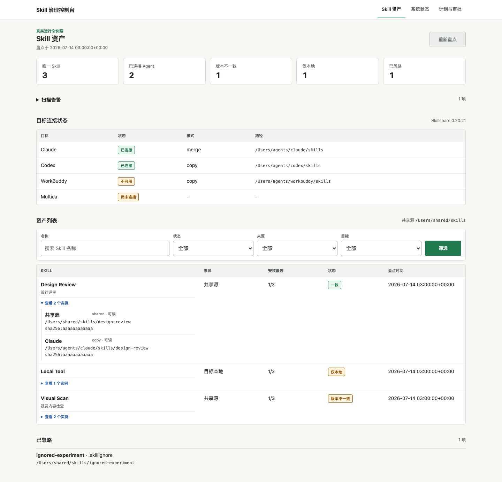

# Skill Governance Control Plane

[English](README.en.md) | 中文

[](https://github.com/PANGKAIFENG/skill-governance-control-plane/actions/workflows/ci.yml)
[](https://www.python.org/)
[](LICENSE)

一个面向个人 Agent 用户的本地 **SkillOps 工作台**：把散落在 Claude Code、Codex、
OpenCode、Qoder、WorkBuddy 等工具里的 Skill 汇总成一份可检查、可追踪的资产清单。



## 它解决什么问题

当你同时使用多个 AI Agent，Skill 很快会变成一组散落的文件夹：同名 Skill 到底有几份、
哪个版本最新、哪个 Agent 漏装、哪些改动只留在本地，通常只能逐个目录检查。

这个项目先解决最基础的一步：**让你看清现在实际拥有什么，再决定是否同步。**

- 汇总多个 Agent 里的真实 Skill，不用逐个翻目录。
- 同名 Skill 自动归并为一个资产，并保留每个 Agent 中的实例信息。
- 标出版本不一致、目标缺失、仅本地和扫描告警。
- 重新盘点只读取现状，不会顺手覆盖或删除你的 Skill。
- 为后续的变更计划、审批、漂移检测和回滚保留治理入口。

## 和 Skillshare 有什么区别

两者是上下游关系，不是替代关系：

| 工具 | 主要回答的问题 | 主要动作 |
| --- | --- | --- |
| [Skillshare](https://github.com/runkids/skillshare) | 如何安装、同步和更新 Skill？ | `install`、`sync`、`collect`、`update` |
| 本项目 | 我拥有哪些 Skill，分布和状态是否健康，变更是否经过检查？ | 盘点、归并、差异展示、计划、审批、漂移与回滚 |

当前 Portal 调用 Skillshare 的只读命令发现真实资产。涉及写入的同步、安装和发布仍由
Skillshare 或其他 Adapter 执行，并且不会在打开页面时自动发生。

## 看板里有什么

- **唯一 Skill**：跨多个 Agent 去重后的能力数量。
- **已连接 Agent**：当前能被安全读取的目标数量。
- **版本不一致**：共享源和 Agent 实例内容不同。
- **仅本地**：只存在于某个 Agent、尚未进入共享源。
- **实例详情**：每个 Skill 的来源、目标、路径、分发方式和内容摘要。
- **系统与计划**：治理目标健康、变更计划、审批记录、漂移和部署记录。

`重新盘点` 只刷新本地快照。失败时会保留上一次成功结果，并明确提示数据可能已过期。

## 三分钟启动

环境要求：

- Python 3.11 或 3.12
- 已安装并初始化 [Skillshare](https://github.com/runkids/skillshare)
- 已安装 [GitHub CLI](https://cli.github.com/)

```bash
git clone https://github.com/PANGKAIFENG/skill-governance-control-plane.git
cd skill-governance-control-plane

python3.11 -m venv .venv
source .venv/bin/activate
pip install -e .

skillctl portal
```

浏览器打开 [http://127.0.0.1:8000/](http://127.0.0.1:8000/)。Portal 只监听本机
回环地址，默认数据保存在 `~/.local/state/skillctl/`。

自定义端口或状态目录：

```bash
skillctl portal --port 8123 --state-dir ./local-state
```

## 安全边界

默认启动行为是保守的：

- 不会自动同步、升级、安装或删除 Skill。
- 不会把 Agent 中的本地修改自动写回共享源。
- 不会执行 GitHub push、PR 或 release。
- 不会写入 Multica，也不会自动调整项目、小队或绑定关系。
- Portal 审批只记录决定，不会通过网页直接执行 `apply` 或 `rollback`。
- Web 服务拒绝绑定 `0.0.0.0` 等非本机地址。

## 治理 CLI

Portal 用于看清现状；CLI 提供需要明确意图的治理动作：

```bash
skillctl status --config /path/to/control-plane.yaml
skillctl plan --config /path/to/control-plane.yaml TARGET_ID
skillctl approve --config /path/to/control-plane.yaml PLAN_ID \
  --approver REVIEWER --decision approved --reason "已核对变更"
skillctl apply --config /path/to/control-plane.yaml PLAN_ID
skillctl drift --config /path/to/control-plane.yaml
skillctl rollback --config /path/to/control-plane.yaml DEPLOYMENT_ID ROLLBACK_PLAN_ID
```

`apply` 和 `rollback` 不会被 Portal 隐式调用。未实现或未验证的 Adapter 能力会拒绝执行。

## 当前阶段

这是一个可运行的早期 MVP，优先覆盖个人多 Agent 环境。当前已完成真实资产盘点、本地
Portal、治理模型、计划审批、漂移检测、Skillshare Adapter 和 GitHub 发布 dry-run。
Multica 写入、更多 Agent Adapter 和团队协作策略仍在 Roadmap 中。

公开待办见 [技术债与 Roadmap](docs/technical-debt.md)。参与开发前请阅读
[贡献指南](CONTRIBUTING.md)；安全问题请按 [安全政策](SECURITY.md) 私下报告。

## License

[MIT](LICENSE)
